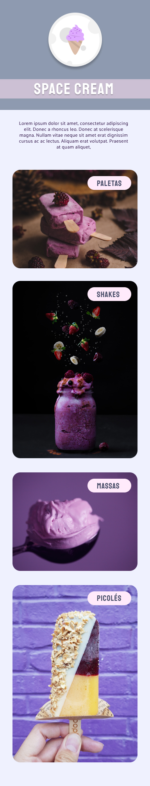

# Space Cream Mobile - Desafio Mobile First (Stage 03)

> Desafio proposto no Stage 03 do Explorer da Rocketseat

O projeto "Space Cream" utiliza tecnologias web padrão, como HTML, CSS e JavaScript, para criar um website responsivo e interativo para promover uma marca fictícia de sorvetes.

HTML: A linguagem de marcação é utilizada para estruturar o conteúdo da página, como cabeçalho, seções e rodapé.

CSS: O Cascading Style Sheets é empregado para estilizar o website, definindo cores, fontes, tamanhos e posicionamento dos elementos.

JavaScript: Embora não esteja presente no código fornecido, o JavaScript pode ser utilizado para adicionar interatividade à página, como animações, validações de formulários ou interações com o usuário.

Google Fonts: A tecnologia incorpora a biblioteca do Google Fonts para carregar fontes personalizadas usadas no projeto, permitindo estilizar o texto de maneira única.

Responsividade: O uso de viewport e porcentagens no CSS possibilita que o website se adapte a diferentes tamanhos de tela e dispositivos, proporcionando uma experiência agradável tanto em desktops quanto em dispositivos móveis.

Em resumo, o projeto "Space Cream" utiliza tecnologias web comuns para criar uma página atraente e responsiva, exibindo informações sobre uma marca fictícia de sorvetes.