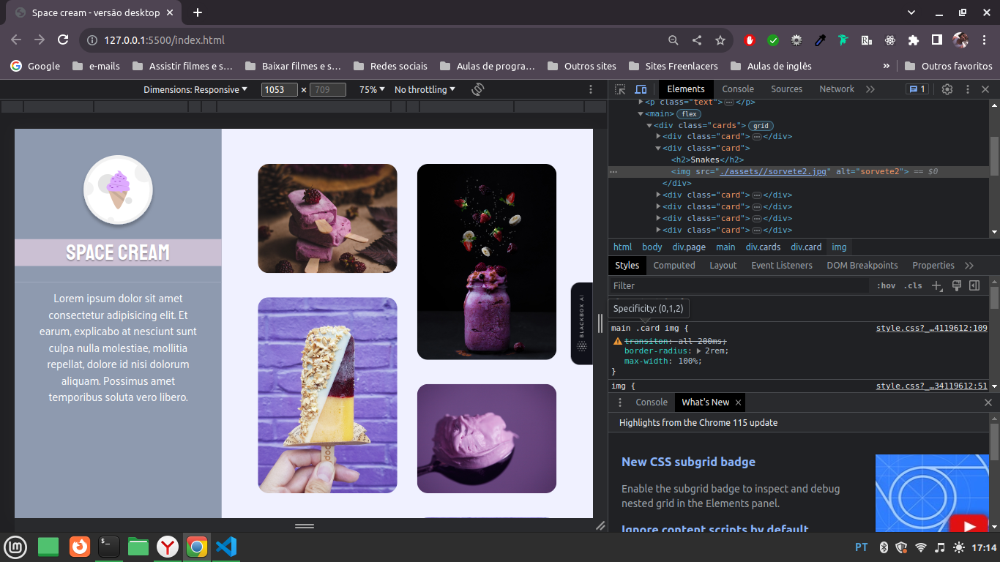

# Space Cream Desktop - Desafio Desktop (Stage 03)

> Desafio proposto no Stage 03 do Explorer da Rocketseat

Este projeto é um site chamado "Space Cream" que apresenta informações sobre uma marca fictícia de sorvetes. O site possui duas versões, uma para desktop e outra para dispositivos móveis (mobile-first).

Tecnologias usadas:

HTML: Linguagem de marcação para estruturar o conteúdo do site.
CSS: Linguagem de estilização para definir o layout e a aparência do site.
Google Fonts: Utilizado para importar fontes personalizadas para o projeto.
Versão Desktop:

A versão desktop é projetada para telas maiores, como monitores de computador. Ela possui uma estrutura em grade para os cards de sorvetes, com imagens lado a lado.
O cabeçalho contém um logotipo e um título "Space Cream" com estilo personalizado de fonte e sombra de texto.
Os cards de sorvetes são exibidos em duas colunas e animados com efeito de entrada.
Versão Mobile:

A versão mobile-first é projetada para dispositivos móveis, como smartphones e tablets. É a primeira versão desenvolvida, com o layout inicial para telas menores.
Os elementos são empilhados verticalmente para melhorar a experiência do usuário em dispositivos com espaço limitado.
A estrutura de grade é substituída por uma exibição de coluna única para os cards de sorvetes.